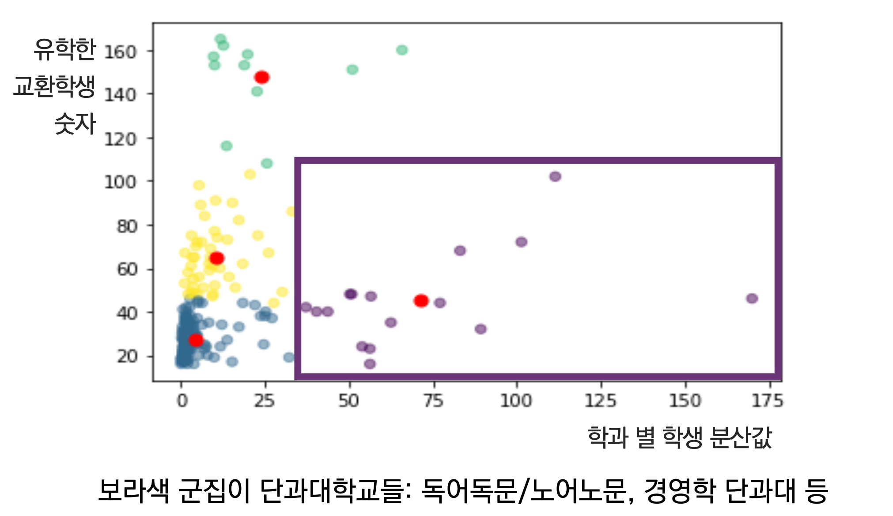

# Yonsei Exchange Universities Analysis

**[Welcome to the yonsei.exchange website](https://yonsei-exchange.netlify.app/)**

2020년 8월 기준 총 11200여 건의 해외 교환 생활 리뷰 텍스트 데이터를 요약 정리함. 교환 후기 데이터는 연세대 학생들이 해외 교환 대학에서 복귀한 직후 의무적으로 작성한 후기임. 

## Goals

- [x] Clustering Universities with their Provided Majors: 각 해외 교환 대학 별 학과 분포 분석 및 군집화
- [x] Analyzing Sentiments for Universities: 각 해외 교환 대학 별 만족도 예측
- [x] Extracting Keywords from Reviews of Universities: 각 해외 교환 대학 별 키워드 추출 
- [x] Summarizing Reviews for Universities: 각 해외 교환 대학 별 후기 요약

## I. Clustering Universities with Majors

* [K-means Clustering with Majors](http://nbviewer.jupyter.org/github/snoop2head/yonsei-exchange-program/blob/master/cluster_departments_Kmeans.ipynb)

## II. Sentiment Analysis for Foreign Universities

* [Labeling with BERT model trained with NSMC Corpus](https://github.com/snoop2head/yonsei-exchange-program/blob/master/analyze_BERT_nsmc.ipynb)
* [Labeling with RNN trained with NSMC Corpus](http://nbviewer.jupyter.org/github/snoop2head/yonsei-exchange-program/blob/master/analyze_RNN.ipynb)

교환 후기 제목들과 이에 대한 BERT, RNN Labeling. 1이 긍정, 0이 부정 혹은 중립

**Example 1: Kristianstad University (Sweden)**

**Example 2: The University of Hong Kong (Hong Kong)**

## III. Extracting Keywords from Reviews of Universities

* [Extracting 50 keywords for each university && Generating wordclouds](http://nbviewer.jupyter.org/github/snoop2head/yonsei-exchange-program/blob/master/extract_keyword_term_frequency.ipynb)

**Example 1: University of Lausanne (Sweden)**

**Example 2: The University of Edinburgh (United Kingdom)**

## IV. Summarizing Reviews for Universities

* [Summarizing reviews into 10 sentences for each university, using textrank](http://nbviewer.jupyter.org/github/snoop2head/yonsei-exchange-program/blob/master/summarize_textrank.ipynb)

**Example 1: Nagasaki University (Japan)**

* `나가사키에 위치해 있고 나가사키 대학교는 3개의 캠퍼스로 나뉜다. `
* `나가사키는 상당히 남쪽에 위치하기 때문에 겨울에도 그렇게 추운편이 아니다. `
* `나가사키대학은 나가사키현의 나가사키시에 위치해 있으며 3개의 작은 캠퍼스로 이루어져 있다. `

**Example 2: University of Copenhagen (Denmark)**

* `코펜하겐의 여름은 날씨가 굉장히 좋고 아름답습니다. `
* `어둡고 추운 겨울을 견디고 오는 코펜하겐의 봄, 여름 날씨는 환상적입니다. `
* `코펜하겐 대학은 캠퍼스가 아닙니다.`

